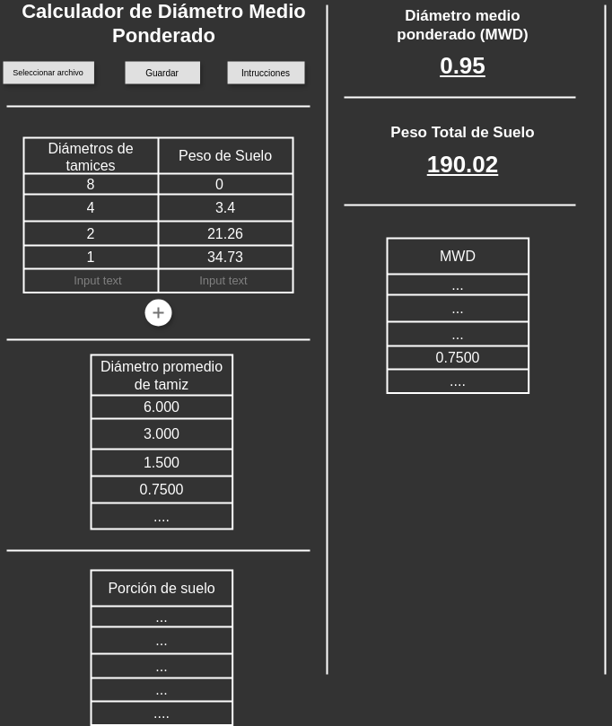

# Calculador MWD: Tercera

Si creo ya entendí el proceso, te paso unos ejemplos hechos por mi.

## Respuestas

¿Que tiempo me tardo?

- R.- Pues es aun pronto para saberlo, pero a groso modo me imagino como 3 o 4
  versiones, pensando en algo holgado, me tomaría cada version como 2 semanas,
  es decir, unas 2 meses, y mínimo 1 mes.
  - Version 1 (.csv y consola)
    - 2 dias: documentación, diagramas, wireframe (igual abra varias versiones).
    - 3 dias: Cálculos a código.
    - 3 dias: Crear flujo de entrada.
    - 3 dias: Crear flujo de salida.
  - Version 2 (.csv y interface de usuario fea)
    - 3 dias: Crear interface de usuario (comunicacion basica).
    - 3 dias: Crear flujo de archivo de antrada y salidas
  - Version 3 (.xlsx y mejor interface de usuario)
    - 3 dias: Mayor interactividad con entradas y salidas
    - 2 dias: Mejor interoperatividad con archivos
  - Version 4
    - 2 dias: Creacion de documentación, manual, etc.
    - 3 dias: historial/base de datos

¿Cuanto $$$?

- R.- Uy si no se, mínimo unos 300 al dia, es que igual no quiero descuidar mucho otro proyecto
  y de vez cuando la carpintería, pero negociando igual podría dedicarle mas tiempo.

## Preguntas

- ¿La cantidad de entradas es variable o fija?, por ejemplo, en la hoja veo que
  son ocho (8 celdas para Diámetro tamiz y 8 celdas para peso de suelo), en teoría
  se podría sacar el MWD desde el primer par (1 par de Diámetro tamiz y 1
  par de peso de suelo) o N cantidad de pares ¿no?.

- Para confirmar ¿Este es considerado un caso/estudio?, es decir, si tenemos
  multiples estudios, cada estudio esta conformado por N pares de muestras de
  diámetro tamiz y peso de suelo. Esto me hace pensar que ustedes van a campo,
  toman nota de las muestras y luego las pasan a la computadora. por lo que
  creo seria mejor introducir la entrada desde un archivo, para que 1) la calculadora
  se adapte a su forma de trabajo actual, y 2) ustedes decidan como manejar el
  historial de estudios.

- ¿Cual seria la definición de terminado?, Porque iría desde hacer los cálculos
  de una forma muy simple, lo cual serial algo incomodo para que el usuario obtenga
  el software y lo use, pero suficiente para publicar un articulo. Hasta una
  aproximación centrada en el usuario, que implicaría obtención e interacción cómoda.

## Replica de proceso

### Entradas

DT = Diámetro de tamiz
PS = Peso de suelo

|   DT |    PS |
| ---: | ----: |
|   10 |     0 |
|    7 |   5.5 |
|  5.5 |  0.25 |
|  4.4 | 20.11 |
|  1.1 | 31.50 |
| 0.25 | 10.05 |
| 0.10 | 35.10 |
| 0.05 | 15.22 |

### Proceso

(Sumar todos los Pesos de suelo)

PST = Peso de suelo total = 117.73

DPT = Diámetro promedio Tamiz

(10 + 7)/2      = 8.5
(7 + 5.5)/2     = 6.25
(5.5 + 4.4)/2   = 4.95
(4.4 + 1.1)/2   = 2.75
(1.1 + 0.25)/2  = 0.675
(0.25 + 0.10)/2 = 0.175
(0.10 + 0.05)/2 = 0.075

PS = Porción de suelo

  5.5 / 117.73 = 0.046717064
 0.25 / 117.73 = 0.002123503
20.11 / 117.73 = 0.170814576
31.50 / 117.73 = 0.267561369
10.05 / 117.73 = 0.085364818
35.10 / 117.73 = 0.298139811
15.22 / 117.73 = 0.129278858

MWD = Diámetro medio ponderado

8.5 x 0.046717064   = 0.397095044
6.25 x 0.002123503  = 0.013271894
4.95 x 0.170814576  = 0.845532151
2.75 x 0.267561369  = 0.735793765
0.675 x 0.085364818 = 0.057621252
0.175 x 0.298139811 = 0.052174467
0.075 x 0.129278858 = 0.009695914

MWD Total

0.397095044+0.013271894+0.845532151+0.735793765+0.057621252+0.052174467+0.009695914 = 2.111184487

### Salidas

PST = Peso de suelo total = 117.73

|   DPT |          PS | MWD         |
| ----: | ----------: | ----------- |
|   8.5 | 0.046717064 | 0.397095044 |
|  6.25 | 0.002123503 | 0.013271894 |
|  4.95 | 0.170814576 | 0.845532151 |
|  2.75 | 0.267561369 | 0.735793765 |
| 0.675 | 0.085364818 | 0.057621252 |
| 0.175 | 0.298139811 | 0.052174467 |
| 0.075 | 0.129278858 | 0.009695914 |

MWD Total = 2.111184487

## Hay dos opciones de primera version

Tal vez haya una tercera pero aun no se me ocurre

### Para presumir

Empiezo por la interface de usuario, que hace casi nada, pero se ve bonito y le
da una idea al usuario de como va a lucir y funcionar al final.



### Para demostrar (recomendado)

Empiezo por convertir el proceso/cálculos a código, pero al inicio solo personas
que sepan manejar la consola de comandos podrán usarlo, pero vaya hará su
prometido desde el inicio.

#### Ejemplo

##### Entada

muestras01.csv

```csv
DT  , PS 
10  , 0 
7   , 5.5 
5.5 , 0.25 
4.4 , 20.11 
1.1 , 31.50 
0.25, 10.05 
0.10, 35.10 
0.05, 15.22 
```

##### Ejecución

```shell
C:\users\sutano> calculadora_mwd.exe C:\users\sutano\muestras\muestras01.csv
Proceso exitoso, archivo creado: muestras01_resultado.csv
```

##### Resultado

muestras01_resultado.csv

```shell
DT   , PS     ,  DPT   , PoSu        , MWDi        ,  PST    ,  MWD
  10 ,      0 ,  8.5   , 0.046717064 , 0.397095044 ,  117.73 ,  2.111184487  
   7 ,    5.5 ,  6.25  , 0.002123503 , 0.013271894
 5.5 ,   0.25 ,  4.95  , 0.170814576 , 0.845532151
 4.4 ,  20.11 ,  2.75  , 0.267561369 , 0.735793765
 1.1 ,  31.50 ,  0.675 , 0.085364818 , 0.057621252
0.25 ,  10.05 ,  0.175 , 0.298139811 , 0.052174467
0.10 ,  35.10 ,  0.075 , 0.129278858 , 0.009695914
0.05 ,  15.22

# DT = Diámetro de tamiz
# PS = Peso de suelo
# DPT = Diámetro promedio Tamiz
# PoSu = Porción de suelo
# MWDi = Diámetro medio ponderado individual
# PST = Peso de suelo total
# MWD = Diámetro medio ponderado
```
