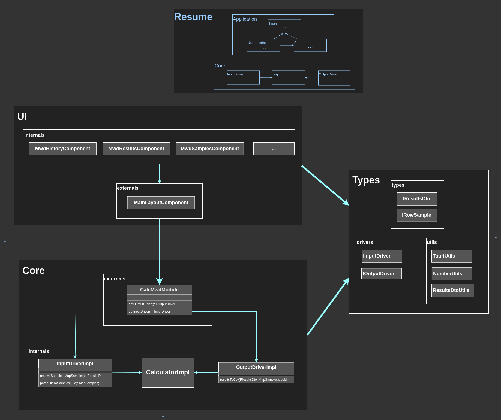

# Calculadora MWD

- [Calculadora MWD](#calculadora-mwd)
  - [Introduction](#introduction)
    - [Strategics and practices applied](#strategics-and-practices-applied)
    - [Tools used on this project](#tools-used-on-this-project)
  - [How to Use the Executables](#how-to-use-the-executables)
    - [If the App Doesn't Run (Missing Web View)](#if-the-app-doesnt-run-missing-web-view)
      - [For Windows Users](#for-windows-users)
      - [For Linux Users](#for-linux-users)
  - [Developer notes](#developer-notes)
    - [How to build](#how-to-build)
      - [Install building tools](#install-building-tools)
      - [Prepare project](#prepare-project)
      - [Build executables](#build-executables)
      - [Steps to deploy on cloud](#steps-to-deploy-on-cloud)
    - [Entity Relationship Objects](#entity-relationship-objects)
  - [References](#references)

## Introduction

Calculator to calculate the mean weight diameter (MWD) of soil, based
on the formulas mentioned in Van Bavel [1] and Yoder, R.E. [2]
papers, This calculator was made in the Angular Framework, and to
make it portable offline, I used Tauri and Electron tools to package
the code on different executables that can be executed on Android,
Windows, and Linux and keep the original Angular building process so
it can be used as usual at any static web server.

### Strategics and practices applied

To create a maintainable code I applied the strategies and practices
mentioned on these two books

- *Get Your Hands Dirty on Clean Architecture by Tom Hombergs*
- *Clean Code by Robert C. Martin*

Which includes the following architectures, practices and tactics.

- Hexagonal Architecture: for internal module structure.

- Component-based architecture: for modules inter-communication.

- Test driven development: Using jasmine for unit testing and cypress
  for end-to-end testing.

- Object oriented programming and SOLID principles: For general coding
  and elements inter-communication.

- Functional programming: to facilitate little flows related with
  events managements.

### Tools used on this project

- Typescript
- Angular
- Electron
- Tauri
- Material UI
- Cypress
- RxJs
- jasmine

## How to Use the Executables

The `calc_mwd_dist.zip` file contains all project executables:

- **`Calculadora-MWD-old-linux-x64/`**: This folder holds the
    Electron-generated executable for 64-bit Linux systems.

- **`Calculadora-MWD-old-windows-x64/`**: Similar to the above,
    but for Windows.

- **`Calculadora-MWD-server`**: This contains code for any static web
    server. It includes `server-linux.executable` and
    `server-windows.exe` to set up a simple local server.

- **`Calculadora-MWD-Android-installer.apk`**: The installer for
    Android. You'll need to **enable installation from unknown sources**
    to use it.

- **`Calculadora-MWD-windows-x64-installer-setup.exe`**: A standard
    Windows installer. It will install the software and dependencies,
    create desktop shortcuts, uninstaller, etc.

- **`Calculadora-MWD-windows-x64-portable.exe`**: This is just the
    calculator app. It relies on a web view component from your
    operating system. If it doesn't run, follow the
    *If the App Doesn't Run (Missing Web View)* instructions.

- **`Calculadora-MWD-linux-x64-installer.AppImage`**: A standard
    Linux installer. It will install the software and dependencies,
    create desktop shortcuts, uninstaller, etc.

- **`Calculadora-MWD-linux-x64-portable.executable`**: This is just the
    calculator app. It relies on a web view component from your
    operating system. If it doesn't run, follow the
    *If the App Doesn't Run (Missing Web View)* instructions.

---

### If the App Doesn't Run (Missing Web View)

Your app requires a web view component to display its interface. This
is usually pre-installed on modern systems. If the app doesn't launch,
follow the instructions for your operating system below.

#### For Windows Users

The app needs **Microsoft Edge WebView2 Runtime**. It's often
pre-installed on Windows 11 and recent Windows 10 versions.

1. Go to the official Microsoft WebView2 download page:
   [https://developer.microsoft.com/en-us/microsoft-
edge/webview2/](https://developer.microsoft.com/en-us/microsoft-edge/webview2/)
2. Under "Evergreen Bootstrapper," click **Download** and run the
   installer. Follow the on-screen prompts.
3. Once installed, try running the application again.

---

#### For Linux Users

The app requires a web rendering engine, typically **WebKitGTK** or
**libwebkit2gtk**. Most modern Linux distributions include this. If
you encounter an error, you may need to install it.

Since there are many Linux distributions, the exact commands vary.
Here is an example commands to install it:

- **Ubuntu:** `sudo apt update &&  sudo apt install libwebkit2gtk-4.0-dev build-essential curl wget file libssl-dev libgtk-3-dev libayatana-appindicator3-dev librsvg2-dev`

<!--

%%%%%%%%%%%%%%%%%%%%%%%%%%%%%%%%%%%%%%%%%%%%%%%%%%%%%%%%%%%%%%%%%%%%%%%%%%%%%%%%
%%%%%%%%%%%%%%%%%%%%%%%%%%%%%%%%%%%%%%%%%%%%%%%%%%%%%%%%%%%%%%%%%%%%%%%%%%%%%%%%

-->

---

<!--

%%%%%%%%%%%%%%%%%%%%%%%%%%%%%%%%%%%%%%%%%%%%%%%%%%%%%%%%%%%%%%%%%%%%%%%%%%%%%%%%
%%%%%%%%%%%%%%%%%%%%%%%%%%%%%%%%%%%%%%%%%%%%%%%%%%%%%%%%%%%%%%%%%%%%%%%%%%%%%%%%

-->

## Developer notes

### How to build

#### Install building tools

1, Install node following [these](https://nodejs.org/en/download) instructions.

2, Install sdkman following [these](https://sdkman.io/install/) instructions.

3, Using sdkman install java and groovy for details use
[this](https://sdkman.io/usage/#latest-stable) reference

4, Install Android Studio and its dependencies using
[this](https://developer.android.com/studio/install#linux) instructions

4, Install Tauri following [these](https://v2.tauri.app/start/prerequisites/)
instructions.

These instructions were follow on a Linux machine and the setup end up with
these versions.

```shell
$ lsb_release -a
# Description: Ubuntu 22.04.5 LTS
# Codename: jammy

$ node -v
# v22.15.1

$ sdk version
# script: 5.18.1
# native: 0.2.2

$ java -version
# "21.0.7" 2025-04-15 LTS

$ echo $JAVA_HOME
# /usr/lib/jvm/java-17-openjdk-amd64

$ echo $NDK_HOME
# /home/m51/Android/Sdk/ndk/29.0.13113456

$ groovy -version
# 2.4.21

$ rustc --version
# 1.86.0 (05f9846f8 2025-03-31)

$ tauri --version
# tauri-cli 2.5.0
```

#### Prepare project

1. clone the repository or unpack the file `calc_mwd_code.zip`

2. get inside the source code `cd calc_mwd/`

3. Download the project dependencies `npm install`

4. We should have the package.json scripts working as set the project on
developing mode: `npm run start`

#### Build executables

**Note:** the main developing is focused on the tool Tauri, it was electron
added, because it has a major compatibility with old computers.

`npm run tauri-build-lin` it builds the installers (.deb and .appimage)
for Linux, and the portable too, it must generate the following files.

- Portable `src-tauri/target/release/mwdCalculator`

- Debian distros installer `src-tauri/target/release/bundle/deb/Calculadora MWD_0.1.0_amd64.deb`

- independent of specific Linux distributions installer: `src-tauri/target/release/bundle/appimage/Calculadora MWD_0.1.0_amd64.AppImage`

`npm run tauri-build-win`: It builds the following executables for windows

- Portable: `src-tauri/target/x86_64-pc-windows-msvc/release/mwdCalculator.exe`

- Installer: `src-tauri/target/x86_64-pc-windows-msvc/release/bundle/nsis/Calculadora-MWD-x64-setup.exe`

`npm run tauri-build-android`: it builds the installer for Android the below
path,
**IMPORTANT:** Check the files for sign apk, it should be the same mentioned on
[this steps,](https://v2.tauri.app/distribute/sign/android/)

- Installer: `src-tauri/gen/android/app/build/outputs/apk/universal/release/app-universal-release.apk`

`npm run electron-build-exe-lin` It builds the portable for old Linux
computers, but it contains the webview and the webApp on sight, ideal
for old computers or modern Operative systems without updates.

`npm run electron-build-exe-win` the same as the last command but for windows.

#### Steps to deploy on cloud

1, Build using command `npm run build-demo`

- Note: This scripts is configured to add a path `/calc_mwd/` which is were live my demos

2, Replace the content in the repository `00_my_demos/calc_mwd` by the new one.

- Note: check that index is a calc_mwd/index.html

3, In the repository `/00_my_demos/calc_mwd` commit and push

4, Go to netlify > look for my_demos repository > press deploy button

### Entity Relationship Objects

As it was said in the introduction, it's being use a combination of
*Hexagonal Architecture* and *Component-based architecture*, it can
be see in the `core` module how I'm using an input and output driver
to isolate the logic, and it can be seeing in each module how each
module have an public part and a private part.



## References

[1]: Van Bavel, C.H.M. 1949. Mean weight diameter of soil aggregates as a
sta s cal index of aggregation. Soil Sci. Soc. Am. J. 17, 416–418.

[2]: Yoder, R.E. 1936. A direct method of aggregate analysis of soils and a study
of the physical nature of erosion losses. J. Am. Soc. Agric. 28: 337–351.
