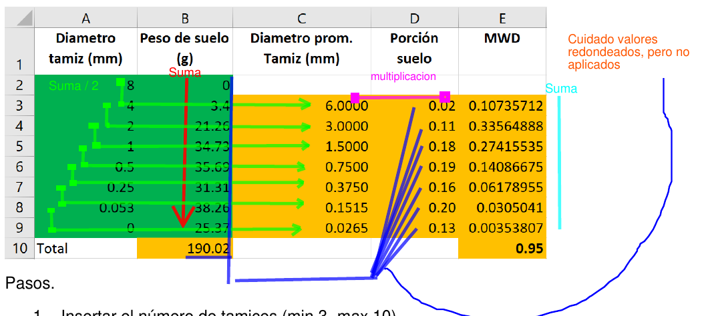
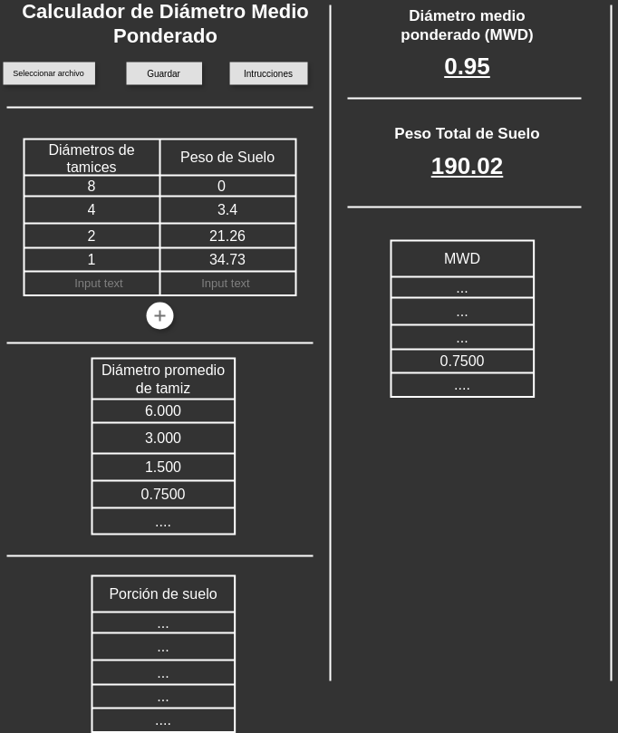
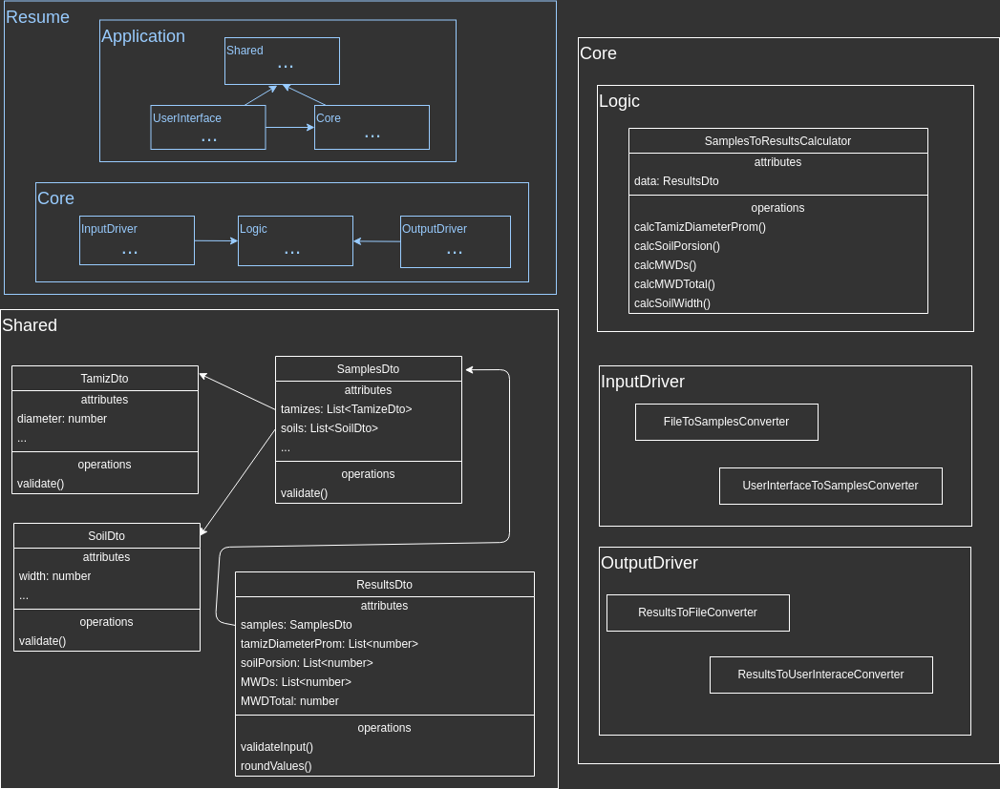

# Calculador MWD: Tercera

Creo que ya entendí el proceso. En resumen es asi, ¿no?.



Hice una ejemplo solo para familiarizarme, checalo, si cometí un error en algún
detalle no hay tanto drama, pero si la regue aplicando el método, tendré que hacer otro,
por que si la riego aplicando el método la riego en el código.

## Respuestas

¿Que tiempo me tardo?

- R.- Pues es aun pronto para saberlo, pero a groso modo me imagino como 3 o 4
  versiones,lo cual que me tomaría cada version como 2 semanas,
  es decir, unos 2 meses en total, hasta donde tengo contemplado (día completo).
  - Version 1 (.csv y consola)
    - 2 días: documentación, diagramas, wireframe (igual habrá varias versiones).
    - 3 días: Cálculos a código.
    - 3 días: Crear flujo de entrada.
    - 3 días: Crear flujo de salida.
  - Version 2 (interface de usuario simple)
    - 3 días: Crear interface de usuario
    - 3 días: Crear flujo de archivo de entrada y salidas
  - Version 3 (.xlsx y mejor interface de usuario)
    - 3 días: Mayor interactividad con entradas y salidas
    - 2 días: Mejor interoperatividad con archivos
  - Version 4 (Pulidos y Empaquetado)
    - 3 días: Checa cualquier detalle de compatibilidad/instalación.
    - 2 días: Creación y homologación de documentación, manual, diagrams, etc.

<div class="page"/>

¿Cuanto $$$?

- R.- Uy si no se, mínimo unos 300 al dia, es que igual no quiero descuidar
  mucho otro proyecto y de vez cuando la carpintería, pero negociando igual
  podría dedicarle mas tiempo.

## Preguntas

- **¿La cantidad de entradas es variable o fija?**, por ejemplo, en la hoja veo que
  son ocho (8 celdas para Diámetro tamiz y 8 celdas para peso de suelo), en teoría
  se podría sacar el MWD desde el primer par (1 par de Diámetro tamiz y 1
  par de peso de suelo) o N cantidad de pares ¿no?.

- Para confirmar **¿esto se considera un caso/estudio?**, es decir, si tenemos
  multiples estudios, cada estudio esta conformado por N pares de muestras de
  diámetro tamiz y peso de suelo. Esto me hace pensar que ustedes van a campo/laboratorio,
  toman nota de las muestras y luego las pasan a la computadora. por lo que
  creo seria mejor introducir la entrada desde un archivo (mi intención seria
  ambos archivo y IU), para que 1) la calculadora se adapte a su forma de trabajo
  actual, y 2) ustedes decidan como manejar el historial de estudios.

- **¿Cual seria la definición de terminado?**, Porque iría desde hacer los cálculos
  de una forma muy simple, lo cual serial algo incomodo para que el usuario obtenga
  el software y lo use, pero suficiente para publicar un articulo. Hasta una
  aproximación centrada en el usuario, que implicaría obtención e interacción cómoda.

- Me indicaste 3 entradas pero solo veo 2, **¿cual es "Cantidad de tamices"?**, solo
  veo "diámetros de tamices" y "peso en cada tamiz".

## Hay dos opciones de primera version

Tal vez haya una tercera pero aun no se me ocurre

### 1. Para demostrar (recomendado)

Empiezo por convertir el proceso/cálculos a código, pero al inicio solo personas
que sepan manejar la consola de comandos podrán usarlo, pero vaya hará su
prometido desde el inicio.

### 2. Para presumir

Empiezo por la interface de usuario y diagramas~manual de uso, que harán casi nada, pero se
ve bonito, le da una idea al usuario de como va a lucir y funcionar al final,
y dará suficiente recursos para crear un articulo.

**Wireframe**: Lo recomendable es usar elementos simples y separados, ya que
escalan bien en vertical (para celular) y en horizontal (para pantalla), pero
un diseñador sabra mas que yo.



<div class="page"/>

**Diagrama de entidad relación de objetos**: Diagrama de código a groso modo (lo mas
seguro terminara luciendo diferente al final, cada rectángulo con texto centrado
o 3 filas es un archivo de texto=código, y cada rectángulo con texto en la esquina
es una carpeta, no represente la interface de usuario por que solo es jerga técnica
pero ahi debería de estar).



**Diagrama de base de datos**: Aun no se si es necesaria, y si la es, lo puedo
hacer al final.

### Ejemplo de primera version (para demostrar)

#### Entada (en forma de archivo)

muestras01.csv

```csv
DT  , PeSu 
10  , 0 
7   , 5.5 
5.5 , 0.25 
4.4 , 20.11 
1.1 , 31.50 
0.25, 10.05 
0.10, 35.10 
0.05, 15.22 
```

#### Ejecución (en consola de comandos)

```c
C:\users\sutano> calculadora_mwd.exe C:\muestras01.csv
Proceso exitoso, archivo creado: muestras01_resultado.csv
```

#### Resultado (en forma de archivo)

muestras01_resultado.csv

```c
DT   , PeSu     ,  DPT   , PoSu        , MWDi      ,  PST    ,  MWD
  10 ,      0 ,  8.5   , 0.046717064 , 0.397095044 ,  117.73 ,  2.111184487  
   7 ,    5.5 ,  6.25  , 0.002123503 , 0.013271894
 5.5 ,   0.25 ,  4.95  , 0.170814576 , 0.845532151
 4.4 ,  20.11 ,  2.75  , 0.267561369 , 0.735793765
 1.1 ,  31.50 ,  0.675 , 0.085364818 , 0.057621252
0.25 ,  10.05 ,  0.175 , 0.298139811 , 0.052174467
0.10 ,  35.10 ,  0.075 , 0.129278858 , 0.009695914
0.05 ,  15.22

/*
* DT = Diámetro de tamiz
* PeSu = Peso de suelo
* DPT = Diámetro promedio Tamiz
* PoSu = Porción de suelo
* MWDi = Diámetro medio ponderado individual
* PST = Peso de suelo total
* MWD = Diámetro medio ponderado
*/
```

## Replica de proceso

### Entradas

DT = Diámetro de tamiz

PeSu = Peso de suelo

|   DT |  PeSu |
| ---: | ----: |
|   10 |     0 |
|    7 |   5.5 |
|  5.5 |  0.25 |
|  4.4 | 20.11 |
|  1.1 | 31.50 |
| 0.25 | 10.05 |
| 0.10 | 35.10 |
| 0.05 | 15.22 |

### Proceso

PST = Peso de suelo total = 117.73

```c
0 + 5.5 + 0.25 + 20.11 + 31.50 + 10.05 + 35.10 + 15.22 = 117.73
```

DPT = Diámetro promedio Tamiz

```c
(10 + 7)/2      = 8.5
(7 + 5.5)/2     = 6.25
(5.5 + 4.4)/2   = 4.95
(4.4 + 1.1)/2   = 2.75
(1.1 + 0.25)/2  = 0.675
(0.25 + 0.10)/2 = 0.175
(0.10 + 0.05)/2 = 0.075
```

PoSu = Porción de suelo

```c
5.5   / 117.73 = 0.046717064
0.25  / 117.73 = 0.002123503
20.11 / 117.73 = 0.170814576
31.50 / 117.73 = 0.267561369
10.05 / 117.73 = 0.085364818
35.10 / 117.73 = 0.298139811
15.22 / 117.73 = 0.129278858
```

MWD = Diámetro medio ponderado

```c
8.5 x 0.046717064   = 0.397095044
6.25 x 0.002123503  = 0.013271894
4.95 x 0.170814576  = 0.845532151
2.75 x 0.267561369  = 0.735793765
0.675 x 0.085364818 = 0.057621252
0.175 x 0.298139811 = 0.052174467
0.075 x 0.129278858 = 0.009695914
```

MWD Total

```c
0.397095044 + 0.013271894 + 0.845532151 + 0.735793765 + 0.057621252 + 0.052174467 + 0.009695914 = 2.111184487
```

### Salidas

PST = Peso de suelo total = 117.73

MWD Total = 2.111184487

|   DPT |          PeSu | MWD         |
| ----: | ----------: | ----------- |
|   8.5 | 0.046717064 | 0.397095044 |
|  6.25 | 0.002123503 | 0.013271894 |
|  4.95 | 0.170814576 | 0.845532151 |
|  2.75 | 0.267561369 | 0.735793765 |
| 0.675 | 0.085364818 | 0.057621252 |
| 0.175 | 0.298139811 | 0.052174467 |
| 0.075 | 0.129278858 | 0.009695914 |

## Ejemplo de código

Si esta seria solo mi chamba, y también aun es pronto para hacerlo, tal vez que
me contestes, ya empiezo.
